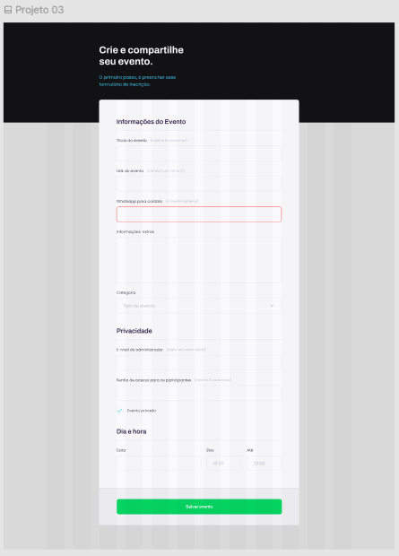

# Rocketform

## Descrição

Esse projeto faz parte de uma aula do curso [Explorer](https://app.rocketseat.com.br/explorer) da [Rocketseat](https://app.rocketseat.com.br/)
 
De forma bem simples trás a proposta de fazer uma página conforme imagem abaixo.
 
Com esse projeto aprendemos um pouco mais sobre:
  
✔️ Estruturando um projeto HTML;
 
 
✔️ Uso de tags HTML mais comuns;
 
 
✔️ Conceitos iniciais de CSS;
 
 
✔️ Posicionamento e alinhamento de elementos na tela;
 
 
✔️ Aplicando fontes customizadas;
 
 
✔️ Espaçamentos.

## Figma do Projeto

## Instalação

Para instalar e rodar o projeto, siga os passos abaixo:

1. Clone o repositório.
2. Abra o arquivo `index.html` no seu navegador.
3. Não é necessário instalar nenhuma dependência.
